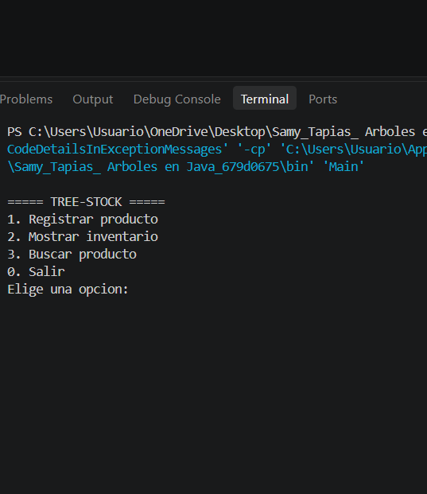
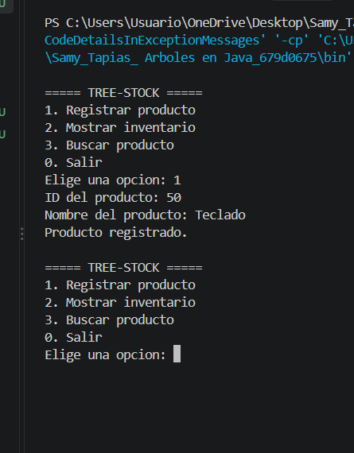
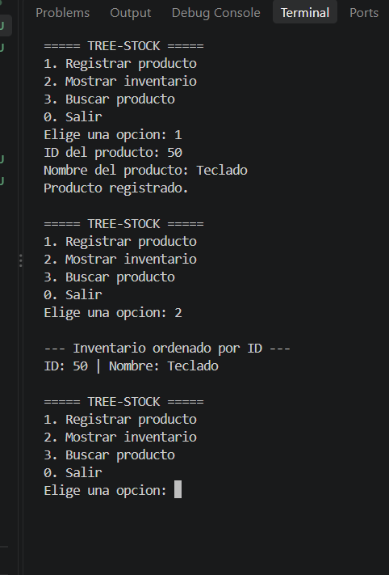
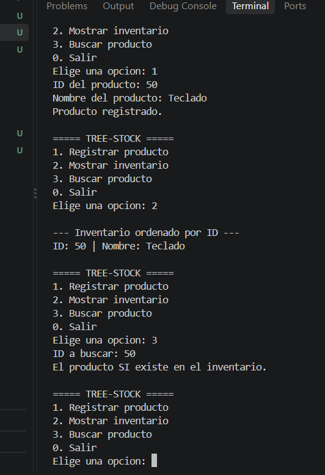
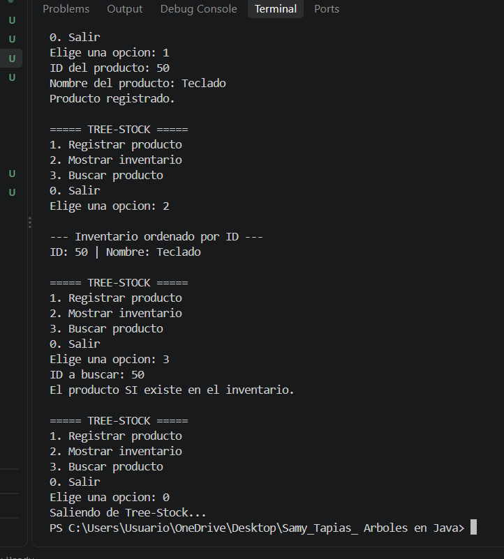

# Tree-Stock

## Datos de los estudiantes

**Nombre:** Daniela Peña Arias y Samy Mallerly Tapias Puerta
**Carrera:** Ingeniería en Software y Datos  
**Evidencia:** Manipulación de Árboles en Java  

## Objetivo

Desarrollar una aplicación de consola en Java que permita gestionar un inventario utilizando un **Árbol Binario de Búsqueda (ABB)**.
El proyecto busca comprender cómo funcionan los árboles y cómo se pueden utilizar estructuras dinámicas para organizar, buscar y mostrar información. Los productos se organizan mediante su **ID**, utilizando punteros hacia un hijo izquierdo y un hijo derecho.

## Descripción del proyecto

**Tree-Stock** es un sistema de inventario desarrollado en Java que permite registrar productos y organizarlos dentro de un Árbol Binario de Búsqueda.
Cada producto contiene un **ID** y un **nombre**. El ID determina la posición del producto dentro del árbol:

- Si el ID es menor que el nodo actual, el producto se ubica hacia la izquierda.
- Si el ID es mayor que el nodo actual, el producto se ubica hacia la derecha.
- No se permiten ID repetidos.

El sistema cuenta con un menú interactivo desde el cual el usuario puede registrar productos, mostrar el inventario ordenado y buscar productos por su ID.

##  Herramientas utilizadas

- **Java**
- **Visual Studio Code**
- **JDK Eclipse Temurin**
- **Git**
- **GitHub**

##  Estructura del proyecto

```text
Samy_Tapias_Arboles en Java/
│── capturas/
│   ├── Menu.png
│   ├── Registro.png
│   ├── Inventario.png
│   ├── Buscar.png
│   └── Salir.png
├
├── src/
│   ├── Producto.java
│   ├── ArbolInventario.java
│   └── Main.java
│── .gitignore
└── README.md

````

## Clases del proyecto

### `Producto.java`

Representa cada nodo del árbol.

Contiene:

* `id`
* `nombre`
* `izquierdo`
* `derecho`

Los punteros izquierdo y derecho permiten conectar cada producto con otros productos del árbol.

### `ArbolInventario.java`

Contiene la lógica principal del Árbol Binario de Búsqueda.

Incluye:

* **Insertar:** agrega productos de manera recursiva según su ID.
* **Recorrido Inorden:** muestra los productos ordenados de menor a mayor ID.
* **Buscar:** permite comprobar si un producto existe mediante su ID.

### `Main.java`

Contiene la interfaz del programa y el menú interactivo.

Permite:

1. Registrar Producto.
2. Mostrar Inventario.
3. Buscar Producto.
4. Salir.

---

##  Definición del Árbol Binario de Búsqueda (ABB)

Un **Árbol Binario de Búsqueda (ABB)** es una estructura de datos en la que cada nodo puede tener como máximo dos hijos: uno **izquierdo** y uno **derecho**.

En este proyecto, cada nodo representa un producto y su posición dentro del árbol se determina mediante el **ID**.

* Si el ID del nuevo producto es menor que el ID del nodo actual, se coloca hacia la izquierda.
* Si el ID es mayor, se coloca hacia la derecha.
* Si el ID ya existe, no se permite registrar otro producto con el mismo ID.

Esta organización permite mantener los productos ordenados y facilita la búsqueda de un producto por su ID.

## Aplicación de la recursividad

La **recursividad** se utiliza para recorrer el árbol y encontrar la posición correcta de cada producto.

En el método `insertarRecursivo()`, se compara el ID del nuevo producto con el nodo actual. Si el ID es menor, el método vuelve a llamarse sobre el hijo izquierdo; si es mayor, se vuelve a llamar sobre el hijo derecho. Este proceso continúa hasta encontrar un espacio vacío donde se pueda colocar el nuevo producto.

La recursividad también se utiliza en el **recorrido Inorden** y en la **búsqueda de productos**. De esta manera, el programa puede recorrer las diferentes ramas del árbol de forma organizada hasta encontrar el producto solicitado o determinar que no existe.

## Funcionamiento del árbol

El árbol organiza los productos utilizando el ID.

Por ejemplo, si se registran los siguientes productos:

```text
50 - Monitor
30 - Teclado
70 - Mouse
20 - Cable
40 - Audífonos
```

El árbol queda organizado de la siguiente manera:

```text
             50
            /  \
          30    70
         /  \
       20    40
```

El recorrido **Inorden** visita primero el lado izquierdo, después el nodo actual y finalmente el lado derecho.

Por esta razón, los productos se muestran ordenados por ID:

```text
ID: 20 | Nombre: Cable
ID: 30 | Nombre: Teclado
ID: 40 | Nombre: Audífonos
ID: 50 | Nombre: Monitor
ID: 70 | Nombre: Mouse
```

## Instrucciones de ejecución

1. Abrir la carpeta de la tarea en Visual Studio Code.
2. Verificar que esté instalado el JDK de Java.
3. Abrir la carpeta `src`.
4. Abrir el archivo Main.java.
5. Presionar el botón Run o ejecutar el programa desde la terminal.
6. Utilizar las opciones disponibles en el menú.

## 🖥️ Capturas de pantalla

### 1. Menú principal

Muestra las opciones disponibles del sistema Tree-Stock.



---

### 2. Registro de productos

Muestra el ingreso del ID y nombre de los productos al inventario.



---

### 3. Inventario ordenado

Muestra los productos utilizando el recorrido Inorden, organizados de menor a mayor ID.



---

### 4. Búsqueda de producto

Muestra la búsqueda de un producto mediante su ID e indica si existe o no dentro del inventario.



## 5. Salir

Se selecciona la opción Salir para finalizar la ejecución del programa.


